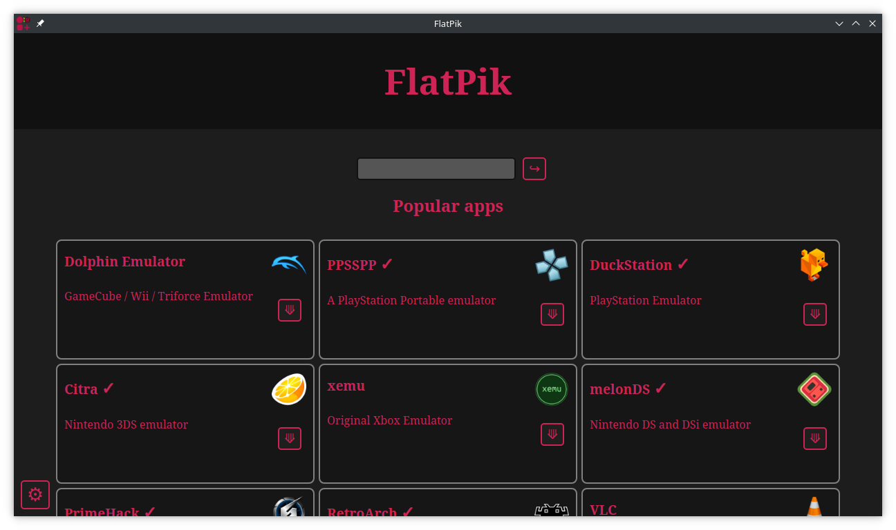

<p align="center"></p>

# FlatPik: the Flatpak App Store for Raspberry Pi

This is FlatPik. It's just a front-end to search and install flatpak apps from Flathub on Raspberry Pi OS, made for fun. That, and for those who doesn't like to use terminal.

It's almost a single .py file, but it needs some modules. Install them using pip or apt. You can create a virtual environment (venv) too.

```shell
pip install PyQt5 PyQtWebEngine requests
```

## Features

* Install `flatpak` package and add Flathub PPA.
* aarch64 apps only (no x86_64 apps since they're not supported on Raspberry Pi).
* Install flatpak apps quickly from the "Install" button. Time will depend on package size and needed runtimes.



## Roadmap

This is a work in progress; not finished at all. Coming soon.

* ~~App icon for FlatPik~~.
* Messages and info abount install progress.
* Update flatpaks.
* Maybe: Uninstall button.
* Maybe: Light theme.
