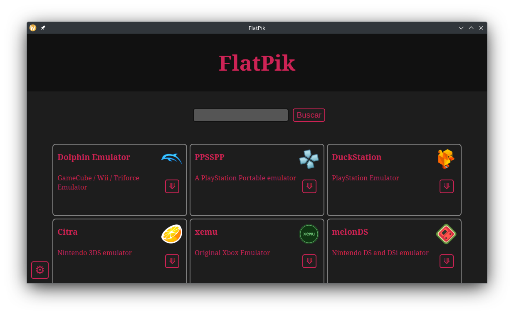

# FlatPik: the Flatpak App Store for Raspberry Pi

This is FlatPik. It's just a front-end to search and download flatpak apps from Flathub, made for fun. That, and for those who doesn't like to use terminal.

It's just a .py file, but it needs modules like Qt5 and requests. Install them using pip or apt. You can create a virtual environment (venv) too.

## Features

* Install flatpak package and add Flathub PPA.
* Filter aarch64 apps (x86_64 apps don't appear since they're not supported on Raspberry Pi).
* Install flatpak apps quickly from the "Install" button.

## Roadmap

This is a work in progress; not finished at all. Coming soon.

* Messages and info abount install progress.
* App icon for this.
* Maybe: Uninstall button. 
