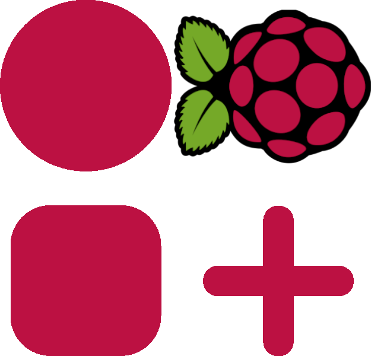
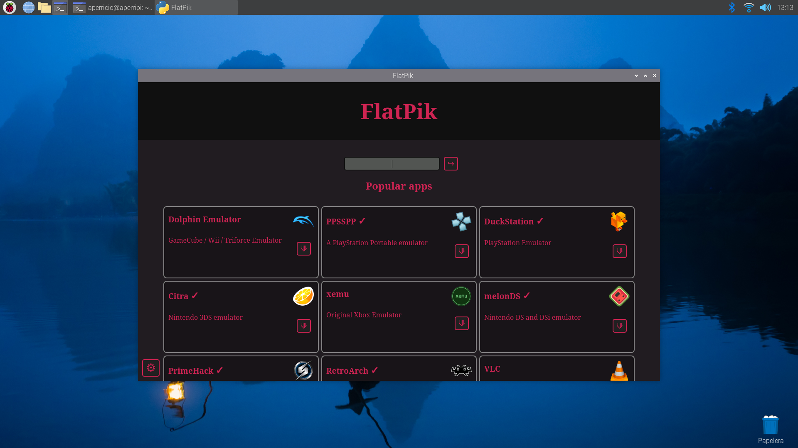

<p align="center"></p>

# FlatPik: the Flatpak App Store for Raspberry Pi

This is FlatPik. It's just a front-end to search and install flatpak apps from Flathub on Raspberry Pi OS, made for fun. That, and for those who doesn't like to use terminal. Everything FlatPik does can be done from console running some commands.

It's almost a single .py file, but it needs some modules. Install them using pip or apt. 

```shell
pip install PyQt5 PyQtWebEngine requests
```

Or

```shell
sudo apt install python3-pyqt5.qtwebengine python3-requests python3-pyqt5
```


## Features

* Install `flatpak` package and add Flathub PPA.
* Install flatpak apps quickly from the "Install" button. Time will depend on package size and needed runtimes.
* Update all flatpaks.
* aarch64 apps only (no x86_64 apps since they're not supported on Raspberry Pi).
* Link to detailed info on app name (official website if website-verified, else Flathub).



## Roadmap

This is a work in progress; not finished at all. Coming soon:

* [ ] Info about install progress (or something).

### Maybe: 

* [ ] Uninstall button.
* [ ] Light theme.
